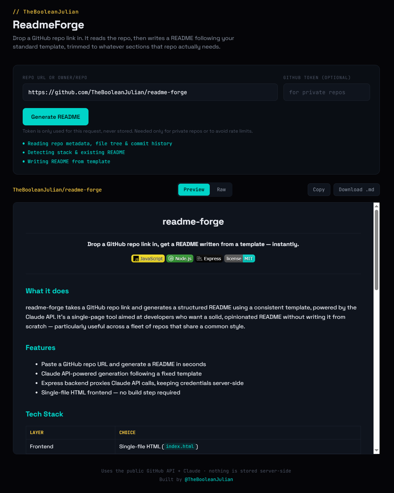

<div align="center">

# readme-forge

**Drop a GitHub repo link in, get a README written from a template — instantly.**


</div>

---



## What it does

readme-forge takes a GitHub repo link and generates a structured README using a consistent template, powered by the Claude API. It's a single-page tool aimed at developers who want a solid, opinionated README without writing it from scratch — particularly useful across a fleet of repos that share a common style. Paste a URL, get a README in seconds.

## Features

- Paste a GitHub repo URL and generate a README in seconds
- Claude API-powered generation following a fixed, opinionated template
- Express backend proxies Claude API calls with rate limiting, keeping credentials server-side
- Single-file HTML frontend — no build step required
- Hero image path detection and changelog generation built into the template output

## Tech Stack

| Layer | Choice |
|---|---|
| Frontend | Single-file HTML (`index.html`) |
| Backend | Node.js + Express |
| AI | Claude API |

## Quick Start

```bash
git clone https://github.com/TheBooleanJulian/readme-forge
cd readme-forge
npm install
cp .env.example .env   # add your ANTHROPIC_API_KEY
npm start
```

## Configuration

| Variable | Required | Description |
|---|---|---|
| `ANTHROPIC_API_KEY` | Yes | Anthropic Claude API key for README generation |

## Project Structure

```
readme-forge/
|-- index.html
|-- server.js
|-- package.json
|-- .env.example
`-- .gitignore
```

## Status / Roadmap

- [x] Single-page UI with repo URL input
- [x] Express backend proxying Claude API
- [x] Rate limiting on `/api/generate`
- [x] Hero image detection in generated output
- [x] Changelog section generated from commit history
- [ ] Support for private repos via PAT

## Changelog

- **July 2026** — Locked down `/api/generate` with server-owned prompt and rate limiting via `express-rate-limit`
- **July 2026** — Added changelog section generated from commit history; added `@TheBooleanJulian` footer credit and real hero image path detection into template output; added hero screenshot and `.env.example`
- **July 2026** — Added Express backend (`server.js`) to proxy Claude API calls server-side
- **July 2026** — Renamed entry point to `index.html` for static hosting compatibility; initial project scaffold

## License

MIT

---

<div align="center">
<sub>Built by <a href="https://github.com/TheBooleanJulian">@TheBooleanJulian</a></sub>
</div>